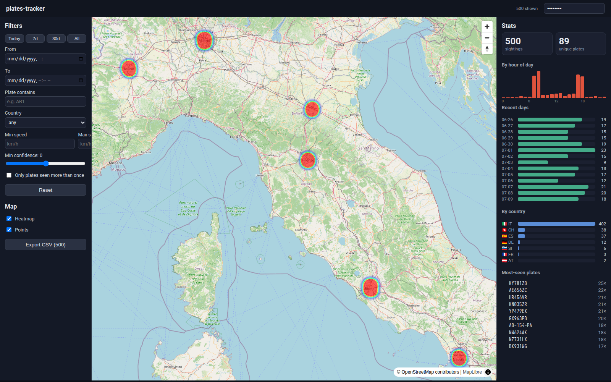
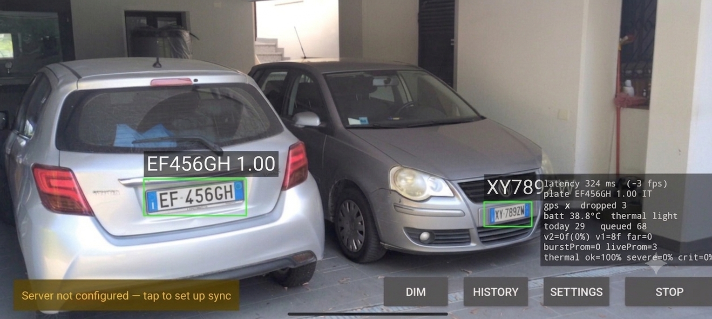

# plates-tracker

Record cars encountered while driving. An Android app detects and reads license
plates from the camera **entirely on-device**, tags each read with time + GPS, and syncs structured
records (text only — never images) to a small private server. A web dashboard shows them on a map
with stats and filters.

Everything runs on open-source ALPR models and a personal, single-user backend — this is a private
log, not a public service (see [Privacy](#privacy)).


## What it looks like

### Web dashboard — map + live stats + filters



Svelte + MapLibre. Left: the shared filter set (time range, plate substring, country, speed,
confidence, "seen more than once"). Centre: an OpenStreetMap heatmap of where plates were seen.
Right: stats that **recompute against the active filters** — totals, by-hour-of-day, recent days,
by-country breakdown, and the most-seen plates. *(Screenshot uses synthetic seed data — the plates
are randomly generated, not real reads.)*

### Android app — on-device reading



The live camera feed with each detected plate boxed and labelled with the decoded text + confidence,
and a HUD (bottom-right) showing rolling latency + frame rate, the best read, GPS status, temperature,
today's count, and the sync-queue depth. Above: two Italian
plates read on-device in a single frame at roughly real-time on the phone **CPU** — no cloud, no NPU.

## How it reads plates

Two open-source ONNX models run in sequence, the same on the workstation spike and on the phone:

1. **Detector** — `yolo-v9-t-384-license-plate-end2end` (YOLOv9-tiny, NMS baked into the graph)
   finds plate bounding boxes.
2. **OCR** — `cct-s-v2-global-model` (a Compact Convolutional Transformer from fast-plate-ocr) reads
   the characters in each crop, and a **country region head** (66 classes → ISO-2) tags each read's
   country straight from the model. (Swapped 2026-07-06 from the legacy
   `european-plates-mobile-vit-v2-model`: 86.7% → 97.5% on Italian plates.)
3. **Validate** — the read is checked against the plate grammar (`shared/`): Italian car/moto/moped
   plus FR, ES, NL, HR, UA, RO formats, weighted by an **issue-date prior** — sequential systems
   (IT/FR/ES) reject series their country can't have issued yet (extrapolated from dated checkpoints,
   no constant to bump), district systems (HR/UA/RO) are gated by their closed prefix-code sets. The
   same chronology dates a plate (`estimate_registration_year`). The shipping read path promotes
   **exact reads only**; position-aware OCR-confusion correction still lives in the reference but is
   **off by default** (it accounted for 0 of the first 24 real promotions). Spec:
   `docs/plate-formats.md`.

On the phone this runs through **onnxruntime-android on CPU/XNNPACK**. The math was proven identical
to the reference (`models/onnx_reference.py`, parity gated at IoU > 0.9) and is locked by unit tests
that compare the Kotlin port against Python-dumped fixtures.

## Architecture

```
        ┌─────────────────────────────── Android phone ───────────────────────────────┐
        │  CameraX  →  Detector (ONNX)  →  OCR (ONNX)  →  PlateValidator  →  overlay  │
        │              (onnxruntime-android, CPU/XNNPACK)          │   + driving HUD  │
        │                                   dedup + time + GPS ────▼                  │
        │                                  SQLite queue  →  WorkManager sync  ────────┼──┐
        └─────────────────────────────────────────────────────────────────────────────┘  │
                                                                        text-only, HTTPS │
                                                                        Bearer token     ▼
┌──────────── Go backend (net/http + SQLite, single binary) ─────────────┐   POST /records
│  POST /records (idempotent batch)   GET /records (bbox+filters)        │◄──────────────┘
│  GET /stats (filtered aggregates)   optional: serves the built webapp  │
└────────────────────────────────────────┬───────────────────────────────┘
                                         │  GET /records, /stats
                                         ▼
┌──────────── Web dashboard (Svelte + MapLibre) ────────────┐
│  map heatmap  +  filters  +  live stats                   │
└───────────────────────────────────────────────────────────┘
```

Only **structured records** cross the network — plate text, timestamp, lat/lon, confidence, speed,
country. No image ever leaves the phone. Uploads are idempotent (client-generated UUID per sighting),
so retries and flaky connectivity can't create duplicates.

## Layout

| Dir        | What | Status |
|------------|------|--------|
| `shared/`  | Canonical plate-validation reference impl + tests (IT + FR/ES/NL/HR/UA/RO, issue-date priors) | ✅ done, 39 tests |
| `docs/`    | Plate-format spec, model specs, device/privacy notes, spike write-up | ✅ |
| `models/`  | ONNX reference, fast-alpr spike test | ✅ real ALPR models; spike verified |
| `android/` | Kotlin/CameraX capture app (ONNX Runtime Mobile): foreground-service capture, **buffered capture v2** (RAM H.264 video ring + burst re-scan of far/small plates, degrading to live-scan-only on encoder failure), multi-frame dedup + promotion, GPS, local queue, WorkManager sync, on-device history with reverse-geocoded addresses, driving HUD (big-plate flash, detection log, temperature) | ✅ full MVP builds + 43/43 unit tests; **on-device reads confirmed on a real phone**; formal Gate-B drive pending |
| `server/`  | Go (`net/http` + SQLite) private API | ✅ built + tested (12 tests, live smoke) |
| `webapp/`  | Svelte + MapLibre dashboard (map + live stats + filters + plate drill-down + CSV export) | ✅ built; verified live against the single-binary server |
| `deploy/`  | Containerfile + compose + podman Quadlet unit (one image: API + webapp) | ✅ image builds; see `deploy/README.md` |

## Build order (per plan)

1. **Phase 0a** — feasibility on **real footage**, workstation, no app
   (`docs/spike.md`, `models/spike_video_test.py`). Gate: do Italian plates read at driving speed? ✅
2. **Phase 0b** — on-device spike via **ONNX Runtime Mobile** (`.onnx` direct). ✅ built;
   reads confirmed on the phone. **Gate B** (sustained daylight drive) is the remaining sign-off.
3. **Phase 1b** — full capture app (detect→OCR→validate→dedupe, GPS, local queue, WorkManager,
   foreground service). ✅ built; drive validation rides on Gate B.
4. **Phase 2** — private backend. ✅   5. **Phase 3** — webapp. ✅

## What you can run today

```bash
# Plate validation (stdlib only) — 39 tests
cd shared && python3 -m unittest -v

# Backend — build, test, and a live smoke run
cd server && go test ./...
API_TOKEN=secret go run .            # listens on :8000

# Web dashboard against a running backend
cd webapp && npm install && npm run dev   # proxies /api → :8000

# Android — build + unit tests without a device (JDK 21; system Java 25 is rejected by AGP)
cd android && ./build-and-test.sh assembleDebug
              ./build-and-test.sh testDebugUnitTest   # 43 tests

# Containered server + webapp (20 MB image) — see deploy/README.md for compose/Quadlet
podman build -f deploy/Containerfile -t localhost/plates-tracker .
podman run -d -p 8000:8000 -e API_TOKEN=secret -v plates-data:/data localhost/plates-tracker
```

See `android/README.md` for the on-device control test and the Gate-B drive procedure.

## Privacy

Private personal log: only structured records leave the phone (no images), authenticated HTTPS
server, configurable retention, optional salted-hash plates. Capturing strangers' plates + location
is personal data — keep it private (a public map would be GDPR-relevant; see the plan).
